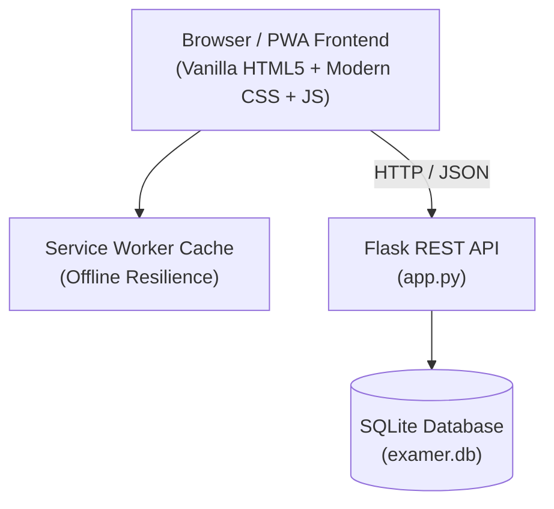

# 🚨 Exam ER — Academic Triage & Rescue System

> **"Find out which exam needs emergency treatment first. Prioritize survival."**

[](https://www.python.org/)
[](https://flask.palletsprojects.com/)
[](https://developer.mozilla.org/en-US/docs/Web/Progressive_web_apps)
[](LICENSE)

---

## 📌 Problem Statement

Students don't fail exams from a lack of study time; they fail because of **misdiagnosed priorities**. When multiple exams approach simultaneously, cognitive overload sets in, leading to decision paralysis, panic-studying low-weightage topics, and preventable failures.

**Exam ER** applies proven **Emergency Room triage protocols** to academic preparation, diagnosing urgency in real time, calculating dynamic study dosages, and prescribing high-yield rescue treatments.

---

## 🩺 The Clinical Metaphor & Triage Algorithm

In an Emergency Room, doctors don't treat patients on a first-come, first-served basis—they treat based on **urgency of survival**.

### Mathematical Triage Formula:
For any admitted subject $s$:

$$\text{Urgency}(s) = \frac{6 - \text{Confidence}(s)}{\max(1, \text{Days Left}(s))}$$

- **Confidence Score**: Rated $1$ (critical failure risk) to $5$ (mastered).
- **Days Left**: Calendar days remaining until the examination date.

### Ward Categories:
| Triage Category | Urgency Score | Condition | Action |
| :--- | :--- | :--- | :--- |
| 🔴 **Code Red (Critical)** | $\text{Urgency} > 1.0$ | Immediate failure threat | First-priority treatment, intensive 45-min Pomodoro sprints |
| 🟡 **Code Yellow (Serious)**| $0.4 < \text{Urgency} \le 1.0$ | Elevated risk | Targeted weak quadrant drills |
| 🟢 **Code Green (Stable)** | $\text{Urgency} \le 0.4$ | Under control | Maintenance testing & review |

---

## ✨ Features

- **⚡ 1-Click Demo Ward**: Pre-loads realistic trauma cases (Critical, Serious, Stable) instantly for live presentations.
- **📈 Dynamic ECG Heartbeat Monitor**: Visual vital wave that accelerates to **135 BPM** in Code Red crisis situations.
- **📊 Real-Time Panic Index**: Aggregate calculation of ward stress with responsive visual alerts.
- **🩺 Clinical Rx (Doctor's Prescription)**: Specific emergency study protocols for each subject, including:
  - *Immediate 2-Hour Action*
  - *Active Retention Strategy*
  - *⚠️ Strict Contraindications* (e.g. banning passive rereading).
- **⏱️ ICU Crash Cart Timer**: Integrated 25-minute Pomodoro emergency focus sprint targeted at the most critical patient.
- **📅 Dynamic 7-Day Rescue Plan**: Automatically distributes the student's daily available hours across all exams weighted by urgency.
- **📱 PWA & Offline Support**: Service worker offline caching and web app manifest ready for mobile home screen installation.

---

## 🏗️ Architecture & Tech Stack



- **Frontend**: Vanilla JavaScript (ES6+), Modern CSS3 with custom variables, SVG animations, Service Worker (PWA).
- **Backend**: Python 3, Flask.
- **Database**: SQLite3 with client-isolated data partitioning.

---

## 🚀 Quickstart Guide

### 1. Clone the repository
```bash
git clone https://github.com/YOUR_USERNAME/exam-er.git
cd exam-er
```

### 2. Install dependencies & Run

#### **Windows (1-Click Launch)**:
Double-click `run.bat` or run:
```powershell
python -m pip install flask
python app.py
```

#### **Linux / macOS**:
```bash
chmod +x run.sh
./run.sh
```

### 3. Open in Browser
Visit **[http://127.0.0.1:5000](http://127.0.0.1:5000)**

---

## 📂 Project Directory Structure

```text
exam-er/
├── app.py                 # Flask application & REST API endpoints
├── requirements.txt       # Dependencies (flask)
├── run.bat                # Windows 1-click startup script
├── run.sh                 # Unix/Linux/macOS 1-click startup script
├── .gitignore             # Standard Python & database ignore rules
├── README.md              # Project documentation & pitch guide
└── static/
    ├── index.html         # Frontend interface, ECG visualizer & logic
    ├── manifest.json      # Progressive Web App manifest
    ├── sw.js              # Service Worker for offline capability
    └── icons/
        ├── icon-192.png   # PWA app icon (192x192)
        └── icon-512.png   # PWA app icon (512x512)
```

---

## 🌐 API Reference

| Method | Endpoint | Description |
| :--- | :--- | :--- |
| `GET` | `/api/subjects` | Fetch all admitted subjects for current client session |
| `POST` | `/api/subjects` | Admit a new subject (`name`, `date`, `conf`) |
| `DELETE` | `/api/subjects/<id>` | Discharge an admitted subject |
| `GET` | `/api/settings` | Get user study capacity (hours per day) |
| `PUT` | `/api/settings` | Update daily study capacity |

---

## 📄 License
Distributed under the MIT License. See `LICENSE` for more information.
